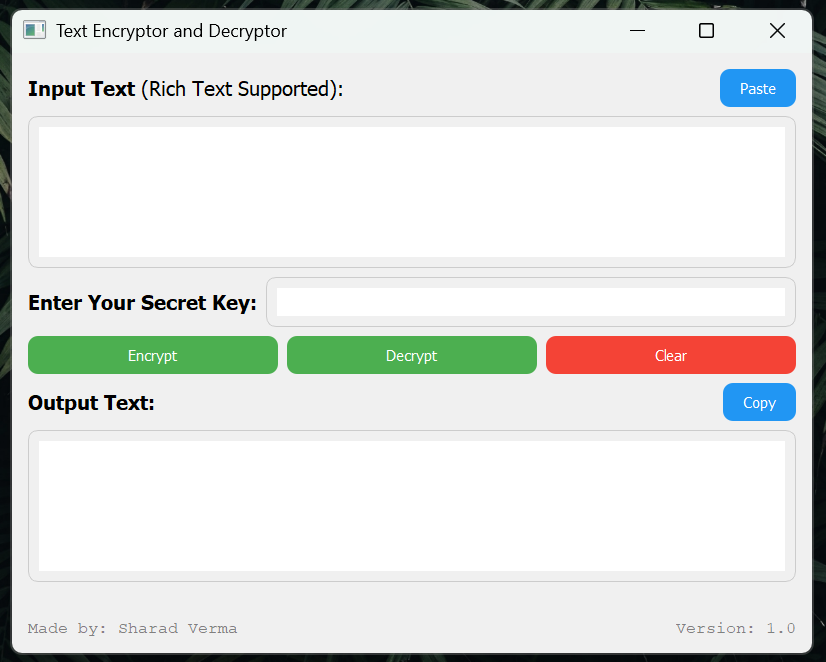

Text Encryptor and Decryptor - README

Overview
--------
This is a simple desktop application that allows users to **encrypt** and **decrypt** text using a **secret key**. The application provides a graphical user interface (GUI) for easy interaction and includes options to **copy** encrypted/decrypted text and **paste** text from the clipboard.

Features
--------
- Encrypt and decrypt text using a secret key.
- Simple and intuitive user interface.
- Option to clear input and output fields.
- Support for copying text to clipboard and pasting from clipboard.

Important Notes
---------------
- This app is designed such that if you encrypt text on one device, you can decrypt it on another device as long as you have the **same secret key**.
- **Do not edit the decrypted text** as any changes made will make it impossible to decrypt it correctly.
- Remember your **secret key** as it is the **password** required to decrypt your text. If you lose it, you will not be able to retrieve the original text.
- The text encrypted in this app will only be decrypted using this app. **No other app, software, or online tool** can decrypt the text encrypted with this tool.
- It may be slow while closing because it clears memory to remove traces of your sensitive data from pc.

How to Use
-----------
1. **Install the application**: Double-click the **Text_Encrypt_Decrypt_(v1.0).exe** file to install the program.
   
2. **Launch it and enter the secret key**: Type your secret key in the provided input box.

3. **Input text**: Type or paste the text you want to encrypt or decrypt.

4. **Encrypt text**:
    - Click the **Encrypt** button to encrypt the input text with your secret key.
    - The encrypted result will appear in the output box.

5. **Decrypt text**:
    - Paste or type the previously encrypted text in the input box.
    - Click the **Decrypt** button to decrypt the text using your secret key.
    - The decrypted result will appear in the output box.

6. **Clear fields**: Use the **Clear** button to clear both input and output fields.

7. **Copy and Paste**: Use the **Copy** button to copy the result to the clipboard, and the **Paste** button to paste text from the clipboard into the input box.

License
-------
This project is licensed under the **Apache License 2.0**.

Made by: Sharad Verma  
Version: 1.0

Instructions to run:
--------------------
1. Download and extract the files.
2. Double-click the **Text Encryptor Decryptor.exe** file to run the application.
